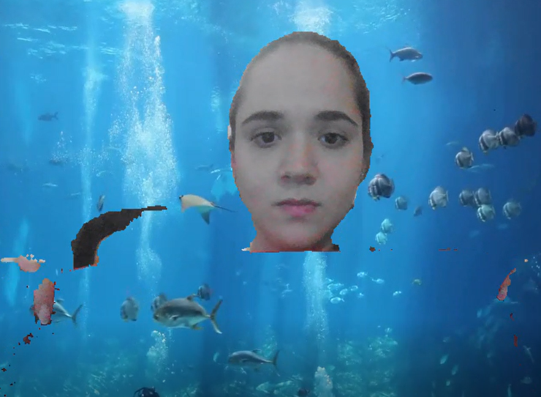

## Reto-2-CV-Challenges

# Harry Potter invisibility cloak with dynamic background.
The objective of this project is to create an invisibility cloak that makes the ilusion of disappearing with a moving background.

The steps of the project are the following:
  - Capture your camera and store the video you want to set as a background.
  - Use the SelfiSegmentation Module of the cvzone library to remove your background.
  - Use the invisibility cloak function to detect if the color of the cloak is present in the image being captured and replace it with your moving background.
  - Display the final result.
  
## Store the background video.
Save your background video in the same folder as your jupyter notebook. It's important to resize it so it matches the size of the video the camera is capturing. 
*Note*
I couldn't upload my background video because of its size but you can download it here https://www.youtube.com/watch?v=fTQz7LwmtX4&t=1s
Remember to change the name of the file so it matches the name in the code.

## Add trackbars to modify the HSV values according to the color of your cloak.
X axis indicate the Hue values.
Y axis indicate the Saturation values.
It's recommended to set the Value value in a range from 20 to 255.
*Example*
If your cloak is blue, set the H value from 100 - 130 and the V value from 20-255. Try moving the saturation values until you get the range that best fits the saturation of the cloak to make the disappearing more credible. 

If you'd like to disappear yourself completely, set the lowest HSV values to 0 and the upper HSV values to 180, 255 and 255 respectively.

## Invisibility cloak.
If you are interested in understanding how the invisibility cloak works, refer to https://github.com/pattycanales/Reto-1-CV-Challenges .

## Final result.
Enjoy the experience of this invisibility cloak with a moving background.

## References.
  - https://www.youtube.com/watch?v=Nv-vehlWnGY&t=433s
  - https://learnopencv.com/invisibility-cloak-using-color-detection-and-segmentation-with-opencv/
  - https://www.youtube.com/watch?v=k7cVPGpnels&t=437s

Thanks for reading!

_Patty Canales_
